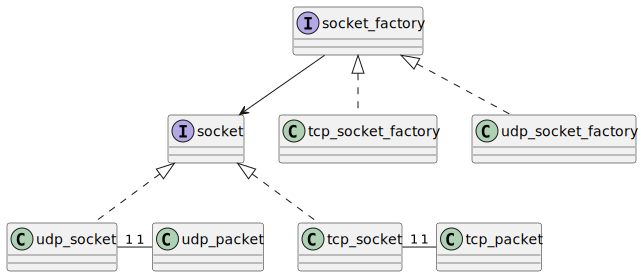

# Welcome to the Socket Programming project

Hi! This is a library for socket programming in C++. 

Built using the Red, Green, Refactor Test Driven Development (TDD). 
    
Technologies used:

- C++
- Bazel build system
- GTest

## Design 



## How to run

1. Install the dependencies 
    - Bazel
    - C++
    - GTest

2. To run unit tests use
   ```
   bazel test posix_tests
   cd ./bazel-bin/test/posix/posix_tests
   ```
     